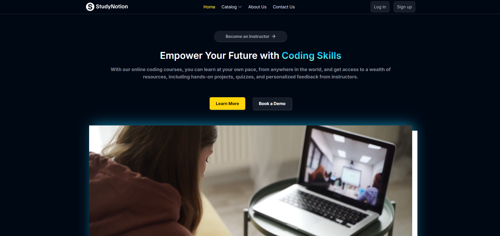
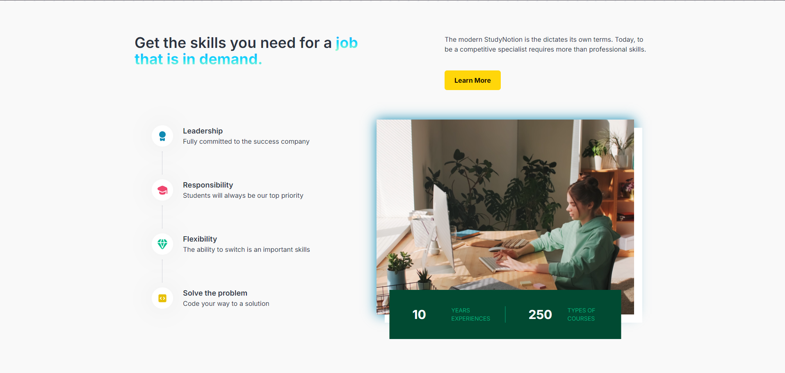
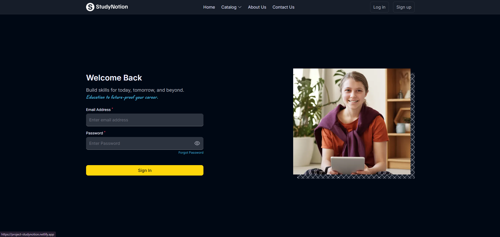
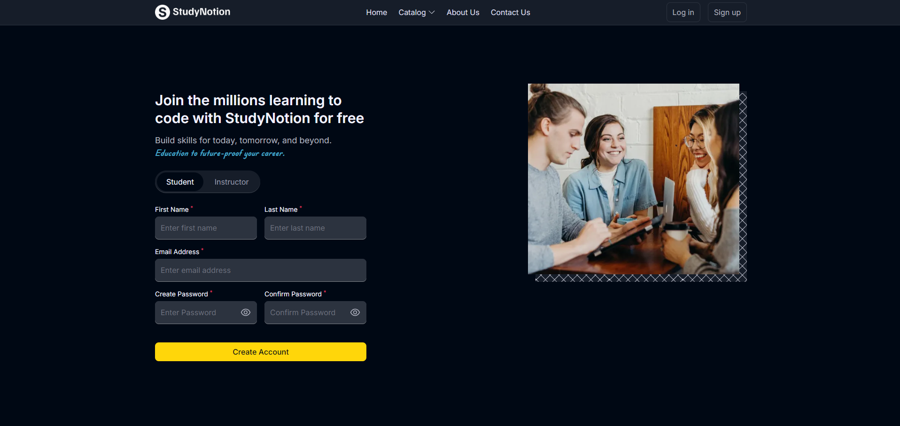
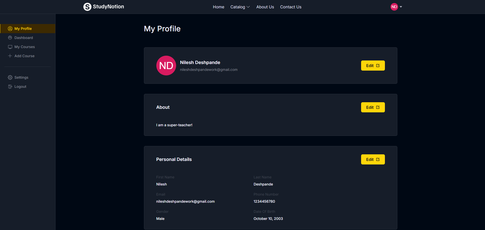
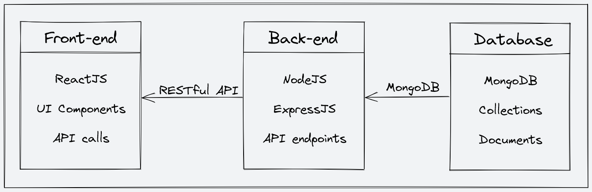

# StudyNotion 


**StudyNotion** is a fully functional ed-tech platform that enables users to create, consume, and rate educational content. The platform is built using the MERN stack, which includes ReactJS, NodeJS, MongoDB, and ExpressJS.

## Table of Contents

1. [Project Description](#project-description)
2. [System Architecture](#system-architecture)
3. [Front-end](#front-end)
4. [Back-end](#back-end)
5. [Database](#database)
6. [API Design](#api-design)
7. [Installation](#installation)

## Project Description

StudyNotion aims to provide:

- A seamless and interactive learning experience for students, making education more accessible and engaging.
- A platform for instructors to showcase their expertise and connect with learners across the globe.

Here are some screenshots of the **StudyNotion** platform:

### Landing Page




### Login Page


### Signup Page


### Profile Page


### Instructor Pages


### Mail Template


## System Architecture

The StudyNotion ed-tech platform consists of three main components:

1. **Front-end**: Built using ReactJS, providing a dynamic and responsive user interface.
2. **Back-end**: Developed using NodeJS and ExpressJS, offering RESTful APIs for the front end to consume.
3. **Database**: Uses MongoDB for flexible and scalable data storage.

The platform follows a client-server architecture, with the front end serving as the client and the back end and database serving as the server.

**Architecture Diagram**


## Front-end

The front end of the platform is built using ReactJS, enabling the creation of dynamic and interactive user interfaces. The front end communicates with the back end using RESTful API calls.

### Features:

- **For Students**:

  - Homepage: Brief introduction, course list, and user details.
  - Course List: List of available courses with descriptions and ratings.
  - Wishlist: Displays courses added to the student's wishlist.
  - Cart Checkout: Enables course purchases.
  - Course Content: Shows videos and related material for a particular course.
  - User Details & Edit: View and edit student account details.

- **For Instructors**:

  - Dashboard: Overview of courses, ratings, and feedback.
  - Insights: Detailed analytics for courses.
  - Course Management: Create, update, and delete courses.
  - Profile Management: View and edit account details.

### Frameworks & Libraries:

- **ReactJS**: JavaScript library for building user interfaces.
- **CSS & Tailwind**: Styling frameworks for responsive design.
- **Redux**: State management for React applications.
- **Development Tools**: VSCode, npm packages for added functionality and Postman for API testing.

### Design:

The front end design was created using Figma. Check out the design [here](https://www.figma.com/file/Mikd0FjHKAofUlWQSi70nf/StudyNotion_shared).

## Back-end

The back end of StudyNotion uses a monolithic architecture, built with Node.js, Express.js, and MongoDB.

### Features:

- **User Authentication & Authorization**: Email, OTP verification, and password reset functionality.
- **Course Management**: CRUD operations for courses and content.
- **Payment Integration**: Razorpay integration for checkout and enrollment.
- **Cloud-based Media Management**: Uses Cloudinary for handling media files.
- **Markdown Formatting**: Supports markdown for course content.

### Frameworks, Libraries, & Tools:

- **Node.js**: JavaScript runtime for back-end development.
- **Express.js**: Web application framework.
- **MongoDB**: NoSQL database for flexible data storage.
- **JWT**: Secure user authentication.
- **Bcrypt**: Password hashing for enhanced security.
- **Mongoose**: ODM library for MongoDB interactions.

## Database

The database for the platform is built using MongoDB, suitable for storing unstructured and semi-structured data, including videos, images, and PDFs. It stores course content, user data, and other relevant information.

## API Design

The back end provides RESTful APIs for the front end, enabling functionalities such as:

- **User Authentication**: Signup, login, OTP verification, and password reset.
- **Course Management**: CRUD operations for courses, including multimedia handling.
- **Payment**: Checkout and payment processing through Razorpay.

## Installation

To set up and run StudyNotion locally, follow the steps below:

### Prerequisites

- **Node.js**: Make sure you have Node.js installed. You can download it from [nodejs.org](https://nodejs.org/).
- **npm**: Node Package Manager, which comes with Node.js. Alternatively, you can use **yarn** if preferred.
- **MongoDB**: You will need to have a MongoDB instance running. You can either set up a local MongoDB server or use [MongoDB Atlas](https://www.mongodb.com/cloud/atlas) for a cloud-based solution.
- **Razorpay Account**: For payment integration.

### Directory Structure

```plaintext
StudyNotion/
│
├── node_modules/        # Node modules for the front-end
├── public/              # Static assets and HTML files
├── server/              # Back-end code
│   ├── config/          # Configuration files
│   ├── controllers/     # API controllers
│   ├── mail/            # Email templates and services
│   ├── middleware/      # Middleware functions
│   ├── models/          # Database models
│   ├── routes/          # API routes
│   ├── utils/           # Utility functions
│   ├── .env             # Environment variables for the server
│   ├── index.js         # Entry point for the server
│   └── package.json     # Dependencies and scripts for the server
│
├── src/                 # Front-end source code
├── .env                 # Environment variables for the front-end
├── .gitignore           # Git ignore file
├── .nvmrc               # Node version management
├── .prettierignore      # Files to ignore for prettier formatting
├── prettier.config.js   # Prettier configuration
├── tailwind.config.js   # Tailwind CSS configuration
├── package.json         # Dependencies and scripts for the front-end
└── README.md            # Project documentation
```

# Setup

Follow these steps to set up and run StudyNotion locally:

### 1. Clone the Repository

First, clone the repository to your local machine:

```bash
git clone https://github.com/NILESHD2003/StudyNotion.git
cd StudyNotion
```

### 2. Install Dependencies

Install the necessary packages for both the front-end and back-end.

#### Front-end Dependencies:

```bash
npm install
```

#### Back-end Dependencies: Navigate to the server directory and install the dependencies:

```bash
cd server
npm install
```
### 3. Configure Environment Variables

You'll need to set up .env files for both the front-end and back-end.

#### Front-end .env file (create in the root directory):

```plaintext
RAZORPAY_KEY = 
REACT_APP_BASE_URL = http://localhost:4000
```

#### Back-end .env file (create in the server directory):

```plaintext
API_KEY = <cloudinary api key>
API_SECRET = <cloudinary api secret>
CLOUD_NAME = <cloudinary cloud name>
FOLDER_NAME = <cloudinary folder name>
JWT_SECRET = 
MAIL_HOST = smtp.gmail.com
MAIL_PASS = 
MAIL_USER = 
MONGODB_URL =  mongodb://localhost:27017/StudyNotion
RAZORPAY_KEY = 
RAZORPAY_SECRET = 
```

### 4. Run the Application

To start the application, you need to run both the front-end and back-end servers.

#### Back-end:

```bash
cd server
npm start
```

#### Front-end:

```bash
cd ..
npm start
```

## Contact
Nilesh Deshpande
    nileshdeshpandework@gmail.com